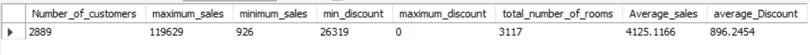
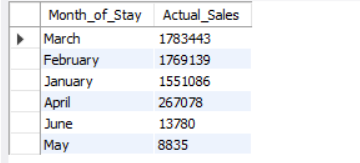
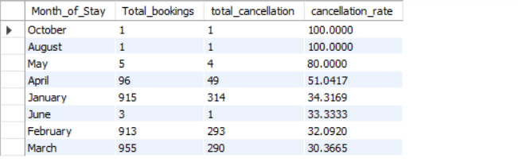
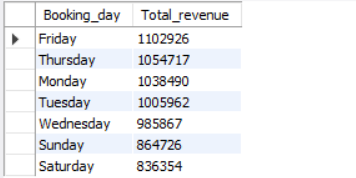

# 🏨 OYO Sales Analysis (SQL Project)

## 📌 Project Overview

This project analyzes OYO hotel booking data using SQL to generate meaningful business insights.
It covers the complete data analysis workflow including data cleaning, transformation, KPI creation, and business-driven analysis.

The objective is to understand booking trends, customer behavior, revenue patterns, and cancellation impact.

---

## 🛠️ Tools & Technologies

* SQL (MySQL)
* Data Cleaning & Transformation
* Aggregations & Joins
* Basic Business Analytics

---

## 📂 Project Structure

```
OYO-Sales-Analysis-SQL/
│
├── README.md
│
├── sql/
│   ├── 01_database_setup.sql
│   ├── 02_data_cleaning.sql
│   ├── 03_constraints.sql
│   ├── 04_kpi_view.sql
│   ├── 05_analysis.sql
│   └── 06_business_queries.sql
│
├── dataset/
│   ├── Oyo_Sales.xlsx
│   └── Oyo_City.xlsx
│
└── images/
    ├── kpi.png
    ├── monthly_sales.png
    ├── cancellation_rate.png
    └── daywise_revenue.png
```

---

## 🔄 Project Workflow

1. **Database Setup** – Created database and imported datasets
2. **Data Cleaning** – Fixed column names, handled date formats, removed inconsistencies
3. **Data Modeling** – Applied primary and foreign key constraints
4. **KPI Creation** – Built summary view for key metrics
5. **Data Analysis** – Performed SQL queries for trends and insights
6. **Business Queries** – Solved real-world business questions

---

## 📊 Key KPIs

* Total Customers
* Total Revenue
* Average Sales
* Total Rooms Booked
* Average Discount

---

## 📸 Key Analysis

### 📊 KPI Dashboard


👉 Provides a quick summary of overall business performance.

---

### 📈 Monthly Sales


👉 Revenue varies across months, indicating seasonal demand trends.

---

### ❌ Cancellation Rate


👉 Higher cancellation rates in certain months impact revenue stability.

---

### 📅 Day-wise Revenue


👉 Certain days contribute more to total bookings and revenue.

---

## 🔍 Key Insights

* Revenue shows strong seasonal patterns across months
* Cancellation rates significantly affect business performance
* A small number of bookings contribute to a large portion of revenue
* Customer booking behavior varies across different days

---

## 📊 Sample SQL Query

```sql
SELECT MONTHNAME(check_in) AS month,
SUM(amount - discount) AS actual_sales
FROM oyo_sales_csv
WHERE status = 'Stayed'
GROUP BY month
ORDER BY actual_sales DESC;
```

---

## 🚀 How to Run

1. Create database in MySQL
2. Import datasets (`Oyo_Sales.xlsx`, `Oyo_City.xlsx`)
3. Run SQL scripts in order:

   * Database Setup
   * Data Cleaning
   * Constraints
   * KPI View
   * Analysis Queries

---

## 🎯 Conclusion

This project demonstrates how SQL can be used to transform raw data into actionable business insights.
It highlights skills in data cleaning, analysis, and problem-solving using real-world datasets.

---

## 👨‍💻 Author

**Avinash Chavan**

* Aspiring Data Analyst
* Skilled in SQL, Excel, and Data Analysis

---
